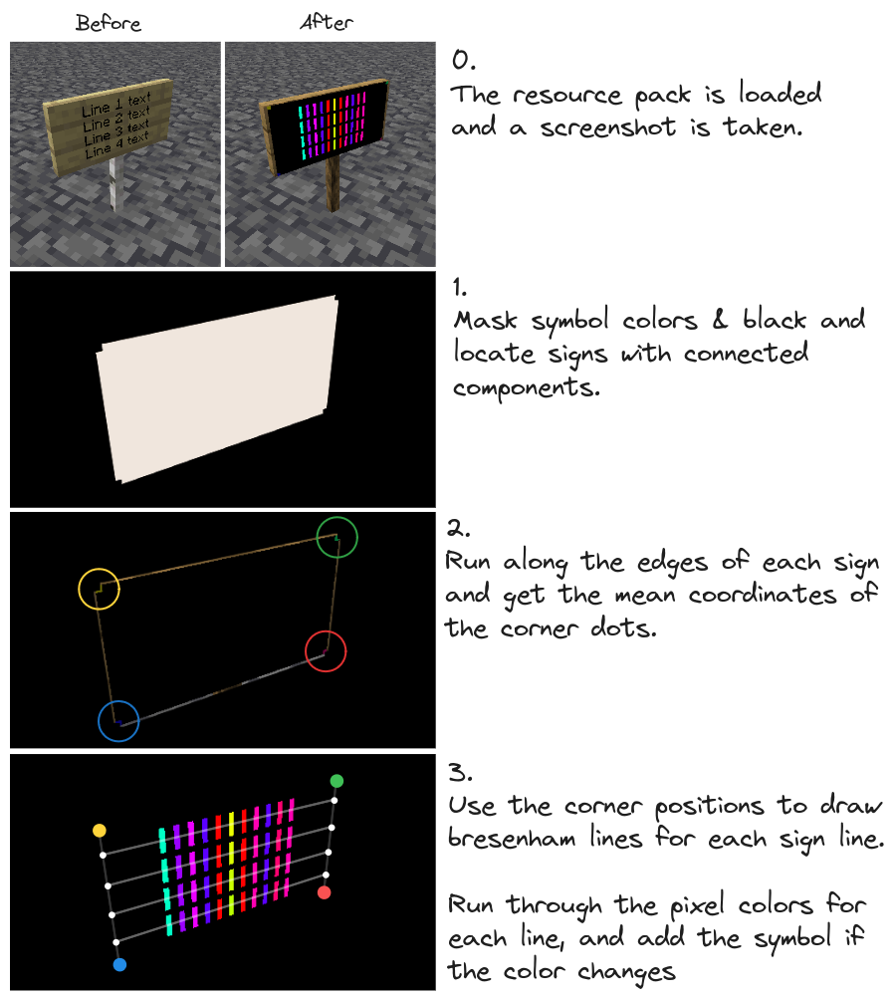

# Minecraft Img2Text

This repository contains a method of reading text in MC. This can be used to read signs, chat messages, or tooltips.

This was made for a personal project, so use it at your own discretion.

Warning: It cannot read non-ASCII symbols.

## How it works

The concept is simple: Create a custom ASCII spritesheet with a mapping between symbols and a unique color. Reading sign text is slightly more complex, but boils down to locating the edges of on-screen signs and reading symbols by checking pixels on each line, determined from the TR, TL, BR, BL image points.

Getting to a working solution was a different story, and was a process of discovering bugs within MC, backtracking solutions, and attempting a new approach. This is why you need OptiFine: Shading and text formatting is very inconsistent, and the custom OpenGL vertex shader makes sure that they are fixed.

## Requirements

 - OpenCV 4.x
 - OptiFine

## Getting started

Get familiar with the UI, because you won't be able to read any text once the resource pack is enabled.

Symlink or copy "resourcepacks/MachineReader" into your resource packs folder and enable it.

Run `cmd.ReadSignLoop(display)`. It will read and write the sign data to `./out/signs.json` and print them to the console. The data is saved to disk when an interrupt occurs, so don't this with `air`.
